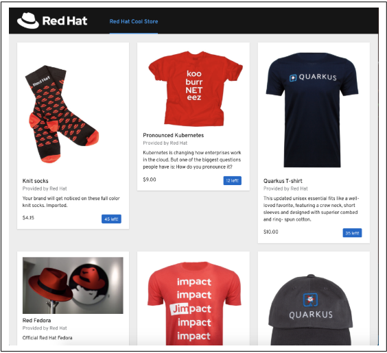
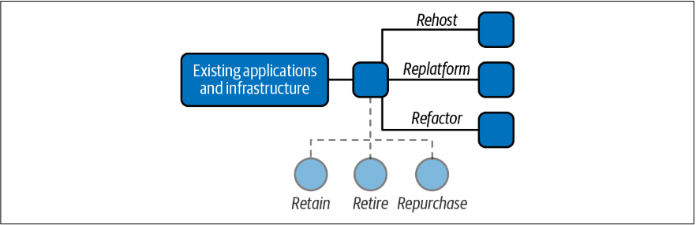
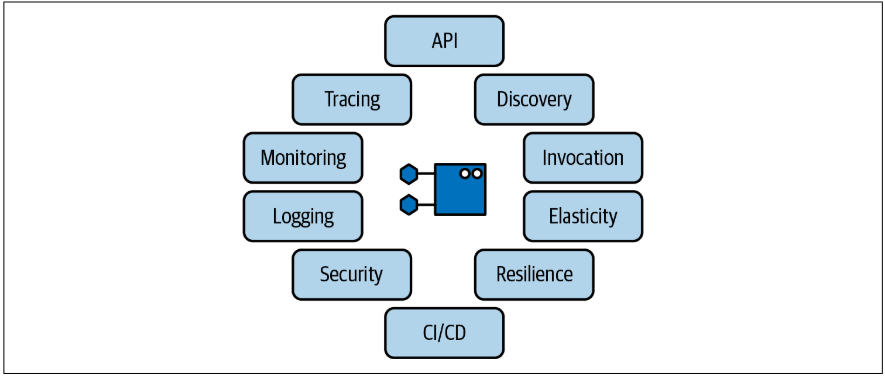
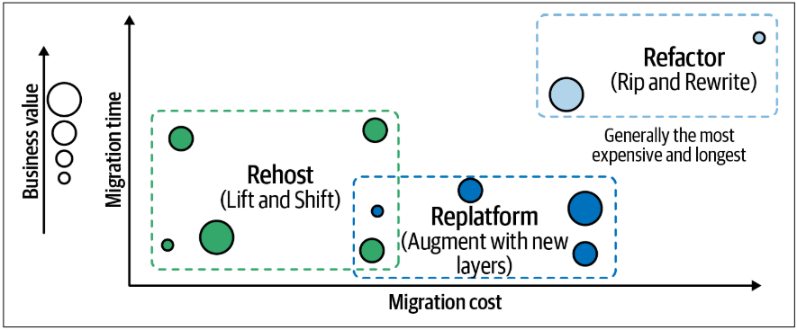
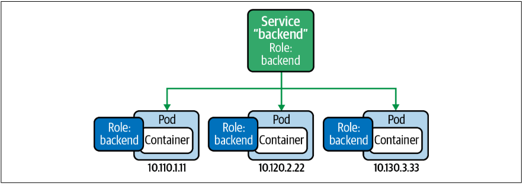
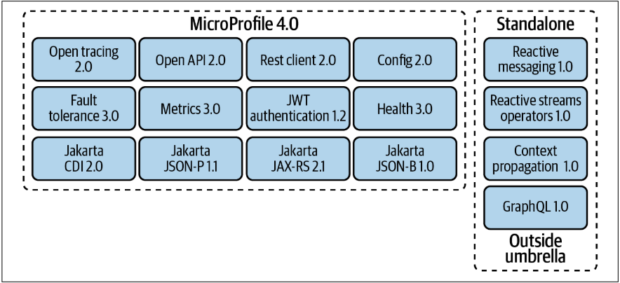
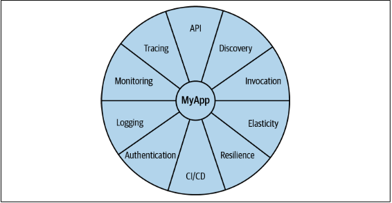
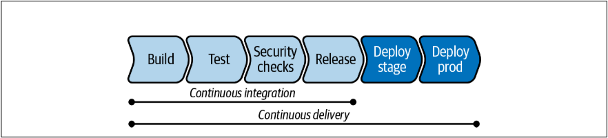
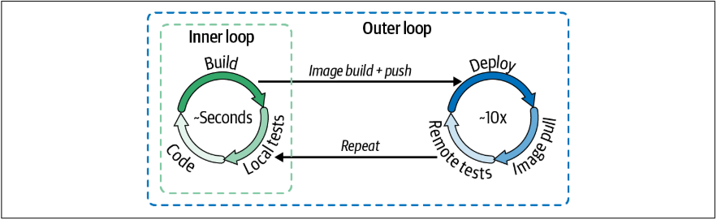

# **`Modern Java Enterprise Applications Notes`**

# **Table of contents**

- [**The Path to Cloud Native Java**](#the-path-to-cloud-native-java)
- [**Travel Light on Your Pathway**](#travel-light-on-your-pathway)
- [**Kubernetes-Based Software Development**](#kubernetes-based-software-development)
- [**Working with Legacy**](#working-with-legacy)
- [**Building Kubernetes-Native Applications**](#building-kubernetes-native-applications)
- [**Tomorrow’s Solutions: Serverless**](#tomorrows-solutions-serverless)

# **Introduction**

# **The Path to Cloud Native Java**

Microservices are an accepted and well-recognized practice nowadays. For JavaEE
developers, this means a lift-and-shift change of the paradigm, where a single application
server does not contain all our business logic. Instead, it gets split into different 
microservices running in their application servers, with a minimal footprint and optimizations
to keep this coexistence functional and performant also in the cloud native world.

## **Example App**

The ecommerce application _Coolstore_ is a typical web app containing three components:

* _Presentation layer:_ 
  a frontend to show available items to acquire
* _Model layer:_ 
  a backend providing the business logic to catalog and index all items to sell
* _Data layer:_ 
  a database storing all records about transactions and items

We map the three previously mentioned components into several microservices, each one responsible
for its layer:

* _Catalog Service_ uses a REST API to expose the content of a catalog stored in a relational database.
* _Inventory Service_ uses a REST API to expose the inventory of items stored in a relational database.
* _Gateway Service_ calls the Catalog Service and Inventory Service in an efficient way. 
* _WebUI Service_ calls Gateway Service to retrieve all the information.

The Presentation and the Model layers are represented by such microservices, with the latter 
having an interface to the Data layer delegated to some DBMS. The e-store implementation is called
_Coolstore_ and looks like the picture:

### **Inventory microservice**

For the Inventory service we need to create our Domain Model and RESTful Service. Once we implemented 
these components we pack an app together with Quarkus, and we can deploy it with a Maven goal.

[Inventory Quarkus](https://github.com/SaladinoBelisario/inventory-quarkus)

You can start the app in dev mode with a built-in Maven goal named _**quarkus:dev**_. It enables hot 
deployment with background compilation, which means that when you modify your Java files or your 
resource files and refresh your browser, these changes will automatically take effect.

### **Catalog microservice**

For the Catalog Service we need to create our Domain Model and RESTful Service also, but a little trick
we can use to do a faster development is using Spring Data to implement a Data Repository

[Catalog Spring Boot](https://github.com/SaladinoBelisario/catalog-spring-boot)

Once we have both microservices implemented it's time to move towards the UI and start by integrating 
both microservices with an API Gateway.

### **API Gateway**

Eclipse Vert.x is an event-driven toolkit for building reactive applications on the Java Virtual
Machine (JVM). VertX does not impose a specific framework or packaging model; it can be used
within your existing applications and frameworks in order to add reactive functionality by just
adding the Vert.x jar files to the application classpath. 

Eclipse Vert.x enables building reactive systems. In our architecture, this microservice will act as 
an asynchronous software API gateway, developed as a reactive Java microservice that efficiently
routes and dispatches the traffic to the Inventory and Catalog component of our cloud native 
ecommerce website.

we want to create an API gateway as the entry point for the web frontend of our website, to 
access all backend services from a single place. This pattern is predictably called **API gateway** 
and is a common practice in microservices architecture.

The unit of deployment in Vert.x is called a _verticle_. A _verticle_ processes incoming events
over an event loop, where events can be anything such as receiving network buffers, timing 
events, or messages sent by other _verticles_.

[API Gateway VertX](https://github.com/SaladinoBelisario/gateway-vertx)

### **Frontend**

Node.js is a popular open source framework for asynchronous event-driven JavaScript development.
Even if this is a book about modern Java development, in microservices architecture it is common
to have a heterogeneous environment with multiple programming languages and frameworks involved.
The challenge here is how to let them communicate efficiently. One solution is having a common 
interface like API gateway exchanging messages via REST calls or queue systems.

AngularJS is a JavaScript-based frontend web framework whose goal is to simplify both the 
development and the testing of such applications by providing a framework for client-side
model–view–controller (MVC) and model–view–viewmodel (MVVM) architectures.

[Node/Angular UI](https://github.com/SaladinoBelisario/web-nodejs)

# **Travel Light on Your Pathway**

Let’s take a deeper look at what makes us think about modernization in general and where to 
start looking for opportunities.

Enterprise software is developed to put business value into code that can be executed within 
nonfunctional and functional requirements. Creating value depends on our ability to deliver
applications quickly. Not only with better quality but also ready to be changed quickly, 
enabling businesses to respond to new challenges or regulatory changes in the market. And these
challenges are multifaceted.

Additionally, you will find operational concerns influencing modernization needs. For example, expiring 
maintenance contracts or outdated technologies can drive technology updates. The continuously
evolving Java language with the shortened release cycles can also influence modernization 
decisions. Modernization can happen at any level of your project, ranging from the execution 
environment (e.g., virtual machines to container) to the Java Virtual Machine (JVM version or 
vendor), individual dependencies, external interfaces, and services.

## **The 6 Rs**

Now that you’ve learned the motivation behind application modernization, you want to identify 
general approaches to modernization and define a categorization for existing applications. 
Doing this helps you manage a variety of different applications, especially in a platform 
modernization project. Rather than looking at the details of a single application, consider 
the complete runtime architecture of traditional Enterprise Java applications. In that case, 
you’ll commonly identify on-premise hardware, which is usually virtualized and made available
to projects via an individual set of instances. Given that individual projects are rarely 
treated as islands without any integrated systems, you get to a situation where a coordinated
approach for more than just one project needs to be found.

### **Retain—Modernize later or not at all**
Systems with this classification need a particular integration approach that needs to be 
explicitly designed. Imagine a highly scalable mobile application backend that connects 
directly to a mainframe. In this scenario, the requests from the potentially many mobile 
devices would overload the costly mainframe. Retain, in this case, does not mean “untouched” but
rather “not moved.”

### **Retire—Turn system off**
Some candidates may clearly have reached end-of-life and are already migrated and replaced or
just a relic that isn’t needed going forward. Travel light and make sure to flag these systems. 
Subsequent housekeeping is as equally essential as building new things. Investing time to
validate and decide on retiring a system is as valuable as a redesign would be.

### **Repurchase—Buy new version**
In some cases, you can repurchase off-the-shelf software and get it ready-made for a new 
execution environment. That sounds straightforward but will most likely include a migration 
project and reevaluation of feature lists, mostly because it is unlikely that you can update 
without changing the product version or its APIs. In some rare cases, you might even find 
missing integration documentation to be a blocker. This is why it is essential to treat this as
a modernization project and not as a simple software update.

### **Rehost—Put into containers**
Often referred to as “lift and shift,” one option for containerizing an application is to 
simply port the existing architecture as-is to run inside a container. While this can be as 
simple as it sounds, there are some challenges on the way. In particular, there can be
difficulties when it comes to optimizing the JVM for constrained container runtimes. Some 
existing middleware application servers come with their vendor supported base images and make
it convenient to switch runtimes. This step is addressing infrastructure modernization and not
concerned with application code directly. Existing applications that qualify for such an
approach are those that need to move to a container runtime before a refactoring can occur or as
an interim step toward switching data center concepts.

### **Replatform—Make some slight adjustments**
As an extension to rehosting, replatforming categorizes applications that undergo a conceptual
or functional change while switching runtimes. It can also be referred to by its own “lift”
name variation, “lift and adjust.” It can be related to a strangled functionality, which might
be implemented on top of a new technology stack or a change in data storage or integration systems. 
We recommend using this approach as an initial step toward refactoring and decoupling a
monolithic application. Prepending this step leads to smoother operations executing on 
subsequent extensions and decoupling stages. By choosing to replatform, you are allowing a 
gentle start to modernizing your applications and pragmatically evolving them.

### **Refactor—Build new**
Refactoring is a disciplined technique for restructuring an existing body of code, altering
its internal structure without changing its external behavior. Refactoring is the most
time-consuming and costly way to move existing applications onto a new runtime or platform. 
It may or may not include a switch to different architecture styles or on-premise or cloud hosting.

## **Divide and Containerize**
Now that we have looked at different modernization strategies for existing applications, and 
we know how and when to apply them. It is time to think about other prerequisites for our
target platform.

The word “platform” in the Enterprise Java world normally refers to the application server. 
Application servers follow a guardrail software development approach with standardized APIs.
The vertical layers are defined by what is commonly referred to as technical layers of a 
three-tier system. Presentation on top of business on top of data access and/or integration.
Horizontally to this we usually find business components or domains. While the vertical layers
are usually well separated and decoupled, it is common to find shared classes and violated 
access rules between the horizontal components. If this happens frequently across the code base,
we talk about entangled designs that turn into unmaintainable monoliths over time.

If we fast-forward to distributed architectures of today, where applications consist of many 
small services, we observe two things: there is no longer a shortcut to a good component design, 
and the standard application server features are no longer available to our components.

Let’s take a detailed look at some of the most critical functionalities, we call them 
_microservicilities_. The term refers to a list of cross-cutting concerns that a service 
**must** implement **apart from the business logic** to resolve these concerns.

### **Discovery and configuration**
Container images are immutable. Storing configuration options inside them for different 
environments or stages is discouraged. Instead, the configuration has to be externalized and 
configured by instance. An externalized configuration is also one of the critical principles 
of cloud native applications. Service discovery is one way to get configuration information 
from the runtime environment instead of being hardcoded in the application. Other approaches
include using ConfigMaps and Secrets.

### **Basic invocation**
Applications running inside containers are accessed through Ingress controllers.
Ingress exposes HTTP and HTTPS routes from outside the cluster to services within the
cluster. Traffic routing is controlled by rules defined on the Ingress resource. You can use 
the routing capabilities to do rolling deployments as the basis for a sophisticated CI/CD 
strategy. For one-time jobs, such as batch processes, Kubernetes provides job and cron-job 
functionality.

### **Elasticity**
Kubernetes’s ReplicaSets control scaling of pods. It is a way to reconcile a desired state:
you tell Kubernetes what state the system should be in, so it can figure out how to reach the 
outcome. A ReplicaSet controls the number of replicas, or exact copies, of a container that 
should be running at any time. What sounds like a largely static operation can be automated. 
The Horizontal Pod Autoscaler scales the number of pods based on observed CPU utilization. It 
is possible to use a custom metric or almost any other application-provided metric as input.

### **Logging**
One of the more challenging aspects of a distributed application is the correlation of logs 
from each active part. This is an area where the difference from traditional application 
servers becomes very visible because it used to be so simple and isn’t in the new world. 
Storing them individually, per container, is not recommended because you lose sight of the 
bigger picture and have a hard time debugging side effects and root causes for issues. There 
are various approaches to this, with most of them extensively using the ELK (Elasticsearch, 
Logstash, Kibana) stack or a variant. In those stacks, Elasticsearch is the object store, where
all logs are stored. Logstash gathers logs from nodes and feeds them to Elasticsearch. Kibana is
the web UI for Elasticsearch, which is used to search the aggregated log files from various 
sources.

### **Monitoring**
Monitoring in a distributed application is an essential ingredient to make sure all the
bits and pieces continue working. In contrast to logging, monitoring is an active observation
often paired with alerting rather than simply recording events. Prometheus is the de facto 
standard for storing the generated information. Essentially, it is a complete open source 
monitoring system that includes a time-series database. Prometheus’s web UI gives you access 
to metric querying, alerting, and visualizations and helps you gain insights into your systems.

### **Build and deployment pipelines**
CI/CD (Continuous Integration/Continuous Delivery) isn’t anything new to Enterprise Java 
applications or distributed applications. As a good software development practice, every
production code should follow a strict and automated release cycle. With a potentially large 
number of services that compose an application, the automation should at least aim for 100% 
coverage. Traditionally a job for the open source tool Jenkins, modern container platforms 
have moved away from a centralized build system and embrace a distributed approach to CI/CD. 
The goal is to create reliable software releases through build, test, and deployment.

### **Resilience and fault tolerance**
Psychologists define “resilience” as the process of adapting well in the face of adversity, 
trauma, tragedy, threats, or significant sources of stress. In distributed applications, it is
the concept of recovering from failure or load scenarios without human interaction. Kubernetes
provides resilience options for the cluster itself, but only sparsely supports application 
resiliency and fault tolerance. For example, application-level resiliency can be facilitated
through PersistentVolumes that support replicated volumes or with ReplicaSets ensuring a 
consistent number of pod replicas across the cluster. On an application level, there is 
resilience and fault-tolerance support through Istio or various frameworks like Cloudstate. You
want to use features such as retry rules, circuit breaker, and pool ejection.

### **Security**
Authentication or Authorization between services is not part of Kubernetes itself. There are 
two ways to implement it. Using Istio, each service is provided with a strong identity that 
represents its role and enables interoperability across clusters and clouds. It secures 
service-to-service communication, as well as providing a key management to automate key and 
certificate generation, distribution, rotation, and revocation.

### **Tracing**
Tracing gives you a way to follow request paths and events throughout the system across
individual application parts by still allowing you to trace back to an origin. You can find
different approaches across the community today. Independent of languages, frameworks, or 
technologies you intend to use, Istio can enable distributed tracing. There are other commercial
and open source projects available helping with distributed tracing across your application 
components. Zipkin and Jaeger are two possible solutions.

## **Define Your Target Platform**
It’s important to note that the nine elements mentioned previously are focused on application
development and do not capture all the necessities of a modern container platform. Just
looking at this narrow focus leaves important areas unaddressed. A container platform needs to
provide features and capabilities for the complete team from Dev to Ops. Depending on specific
needs, there is no one-size-fits-all solution. A comprehensive way to define your target 
platform is to start with the three main layers: Core, Customer Experience, and Integration, 
then build your application landscape on an optimized technology stack. What sounds like a 
ready-to-use checklist is anything but. Companies are different in culture, technologies, and 
requirements, and the following lists are a recommended starting point without any claim to 
comprehensiveness.

### **Define the core**
Start with evaluating the core part of the platform. This category includes basic capabilities
like **container orchestration, storage mapping, rolling upgrades, site reliability engineering(SRE)
requirements, out-of-the-box support for the desired deployment models, and might even include
further support for virtual machines**. This category represents the technical foundation for 
your target platform:

* **Existing core capabilities** 
* **Functional gap assessment** 
* **Hybrid-cloud support** 
* **Security integration**
* **Managed services support** 
* **Operators/marketplace available (e.g., OperatorHub, Red Hat Marketplace)** 
* **Available support levels** 
* **Target deployment model** 
* **Core modernization approach**

### **Define the customer experience layer**
When thinking about platforms, one part gets too little attention: the customer experience 
layer, which contains a technical definition for the customer channels to the platform. A 
channel can be one of the B2X (business to something) portals or various other specific 
frontends. A cohesive platform that can host various applications also needs to include a clear
definition for the technical composition of the individual services:

* **Define customer-centric requirements** 
* **Assess existing cx framework versus build** 
* **Micro frontends (e.g., Entando)** 
* **Integration requirements** 
* **Data gap analysis** 
* **Mobile support**

### **Define the integration**
In a containerized world, integration becomes a new challenge. Coming from a traditional 
enterprise landscape, it has either been a centralized solution (Enterprise Service Bus or 
similar) or been part of the individual applications using some common integration framework 
like Apache Camel. Neither approach fits perfectly into a stateless container-oriented 
platform. What you are looking for in a target platform is the smooth integration between 
messaging components, data transformation logic, and service integration. All the relevant
parts need to scale well in a stateless environment for distributed systems, and it should be 
easy to extend a composed application with new capabilities:

* **Existing integration capabilities** 
* **Evaluate partner solution ecosystem** 
* **Define integration requirements (data sources, service integration, messaging, APIs)**
* **Define standards and frameworks (e.g., Camel K)** 
* **Evaluate serverless/knative integration (e.g., Camel K)**

### **Define the technology stack**
The remaining category focuses on individual technologies and frameworks. Think of it as a
blueprint repository defining the relevant technologies, services, and methodologies for a
productive environment. An underestimated influence on the requirements in this category is 
the available development skill in an organization. With a traditional Enterprise Java
background, it is not easy to completely switch to a reactive development approach and a 
stateless application design. Also, familiarity with existing APIs and time to productivity on
a new platform play a crucial role in picking the most suitable technology stack:

* **Technology stack assessment across core, CX, and external services** 
* **Microservices framework (e.g, Quarkus, Spring Boot)** 
* **Implementation recommendation (reactive, imperative, message-driven, etc.)** 
* **Deployment model (IaaS, PaaS, hybrid)** 
* **Define target development platform** 
* **Development skills gap analysis**

## **Mandatory Migration Steps and Tools**
Following the basic assumption that you have an existing application landscape in place and
cannot start everything as a green-field project, we emphasize moving existing applications 
into containers. Coming back to the 6 Rs from earlier, the first application you are taking
a look at should fall into one of the following Rs: Rehost, Replatform, and Refactor. While 
they look similar in their description, the most significant difference between the three 
approaches is business value versus migration time and cost.

# **Kubernetes-Based Software Development**

## **What is Kubernetes?**
As a container-orchestration platform, its focus is primarily on ensuring that our apps are 
running correctly, providing out-of-the-box self-healing, recovery, and a powerful API to 
control this mechanism. You may be wondering now: as a developer, why should I care about 
Kubernetes if it is so self-proficient? That’s a good question, and maybe a good answer is an 
analogy: you have a Formula 1 car with autopilot, but if you want to win the race, you need to
tune and set up your car to compete with all other good ones. The same is true for your apps, 
which can benefit from all the capabilities offered by the platform to tune them, so they run
optimally.

### **What Kubernetes does?**
When you have Kubernetes as a target platform to run your applications, you can rely on an 
ecosystem of APIs and components put in place to make deployments easier so developers can 
focus only on the most important part: coding. Kubernetes provides you with a framework to run 
distributed systems resiliently. In practice, this means you don’t need to reimplement custom 
solutions when it comes to:

_**Service discovery**_ 
Kubernetes uses internal DNS resolution to expose your apps; this is automatically assigned and
can also be used to send the traffic to multiple instances of your app.

_**Load balancing**_ 
Kubernetes takes care of managing the load on your apps, balancing the traffic, and distributing
user requests accordingly.

_**Self-healing**_ 
Kubernetes discovers and replaces failing containers automatically, providing a health check 
and self-healing mechanism out of the box.

_**Rollout and Rollback**_
Kubernetes ensures your app is always running consistently at the desired state, providing 
control to scale up and scale down workloads. In addition, it offers the capability to roll out 
or rollback to a specific version of your application.

### **What Kubernetes does not do**
Many headaches that developers usually need to deal with in production are already solved and
delegated to a platform, whose primary goal is to ensure applications are running. But does 
that provide all you need for modernizing your apps? Probably not.

The modernization steps toward a cloud native approach are more closely tied to a methodology 
rather than a specific technology. Once you’ve converted your mindset from building monolithic
apps to creating microservices, we are in a good position to start thinking big. Nowadays, many
apps run on cloud platforms targeting Kubernetes, and those are the ones running global-reach
workloads. Here are some things to consider:

* **Kubernetes doesn’t know how to handle your app**. It can restart it if it fails, but it cannot 
understand why that is happening, so we need to ensure we have full control of our 
microservices-based architecture and be able to debug each container. This is particularly 
important in the case of a large-scale deployment.
* **Kubernetes doesn’t provide any middleware or application-level services.** Granular 
discovery services need to be addressed by interacting with Kubernetes API or relying on some 
service on top of Kubernetes, such as a service mesh framework. There is no ecosystem for 
developers out of the box.
* **Kubernetes doesn’t build your app.** You are responsible for providing your app compiled and 
packaged as a container image or relying on additional components on top of Kubernetes.

## **Container images**
The first step for you in this journey is to containerize your microservices, so they can be 
deployed into Kubernetes as a Pod, which is controlled by using a YAML file, invoking the API,
or using a Kubernetes Java client.

### **Dockerfile**
Writing a Dockerfile to package our app as a container is pretty straightforward for simple
use cases.

### **Building Container Images**
Now you need to create the container image. Docker is a popular open source project to create
containers; you can download it for your operating system and start using it to build and run
your containers. Podman is another open source alternative to do this, and it can also generate
Kubernetes objects.

### **Run Containers**
Running containers refers to pulling the container images from the container cache to run 
applications. This process will be isolated by the container runtime (such as Docker or Podman) 
from the other ones in our workstation, providing a portable application with all dependencies 
managed inside a container and not in our workstation.

### **Registry**
As we described in the previous section, container images are stored in a local cache. However,
if you want to make them available outside your workstation, you need to send them over in some
convenient way. A container image’s size is generally hundreds of megabytes. That’s why you 
need a container image registry.

The registry essentially acts as a place to store container images and share them via a process 
of uploading to (pushing) and downloading from (pulling). Once the image is on another system, 
the original application contained within it can be run on that system as well.

Registries can be public or private. Popular public registries include Docker Hub and Quay.io.
They are offered as a SaaS on the internet and allow images to be available publicly with or 
without authentication. Private registries are usually dedicated to specific users and are not 
accessible for public usage. However, you may make them available to private environments, such 
as private Kubernetes clusters.

## **Deploying to Kubernetes**
Deploying applications to Kubernetes is done by interacting with Kubernetes API to create the
objects representing the desired state of the app in a Kubernetes cluster. As we discussed, 
Pods, Services, and Deployments are the minimum objects created to let Kubernetes manage the
entire application life cycle and connectivity.

Every object in Kubernetes contains the following values:

_**apiVersion**_
Kubernetes API version used to create this object

_**kind**_
The object type (e.g. Pod, Service) 

_**metadata**_
Pieces of information that help uniquely identify the object, such as a name or UID

_**spec**_ 
The desired state for the object

### **Pod**
A Pod is a group of one or more containers with shared storage and network resources and a 
specification for how to run the containers. You can see a representation of
two Pods in a Kubernetes cluster, with an example IP address assigned by Kubernetes to each of
them:

### **Service**
Kubernetes Services are used to expose an application running on a set of Pods. This is useful
because a Pod gets a random IP address from the Kubernetes network, which may change if it is
restarted or moved to another node within a Kubernetes cluster. Services offer a more 
consistent way to communicate with Pods, acting as a DNS server and load balancer.

A Service is mapped to one or more Pods; it uses the internal DNS to resolve to an internal IP 
from a mnemonic short hostname (e.g., inventory-quarkus), and balances the traffic to the Pods
as shown:

Each Service get its own IP address from a dedicated IP address range, which is different from 
a Pod's IP address range.

### **Deployment**
Deployments are Kubernetes objects created for managing an application life cycle. A
deployment describes a desired state, and Kubernetes will implement it using either a rolling 
or re-create deployment strategy. The rollout life cycle consists of progressing, complete, and
failed states. A deployment is progressing while it is performing update tasks, such as
updating or scaling Pods.

Kubernetes' deployments offer a set of capabilities on top of the basic Pod and Service concepts as 
listed next:

* Deploy a ReplicaSet or Pod 
* Update Pods and ReplicaSets 
* Rollback to previous deployment versions 
* Scale a deployment 
* Pause or continue a deployment 
* Define health checks 
* Define resources constraints

Managing applications with a Kubernetes deployment includes the way in which an application 
should be updated. A major benefit of a deployment is the ability to start and stop a set of 
Pods predictably. There are two strategies for deploying apps in Kubernetes:

_**Rolling update**_ 

  It provides a controlled, phased replacement of the application’s Pods, ensuring that there 
  are always a minimum number available. This is useful for the business continuity of an
  application, where the traffic is not routed into a new version of the application until the 
  health checks (probes) on the desired number of Pods deployed are satisfied.

**_Re-create_** 

  It removes all existing pods before new ones are created. Kubernetes first terminates all 
  containers from the current version and then starts all new containers simultaneously when the 
  old containers are gone. This provides downtime for the app, but it ensures there aren’t 
  multiple versions running at the same time.

## **Kubernetes and Java**

From a Java developer perspective, the first step is to migrate from the monolithic approach 
to a microservice-based approach. Once that is complete, the next step is to get into the
Kubernetes context and maximize the benefits this platform offers: API extensibility, a 
declarative model, and a standardized process where the IT industry is converging.

There are Java frameworks that help developers connect to Kubernetes and convert their apps to
containers.

### **Jib**
Jib is an open source framework made by Google to build container images compliant to the Open
Container Initiative (OCI) image format, without the need of Docker or any container runtime.
You can create containers even from your Java codebase because it offers a Maven and Gradle
plug-in for that. This means Java developers can containerize their app without writing and/or 
maintaining any Dockerfiles, delegating this complexity to Jib.

We see the benefits from this approach as follows:

_**Pure Java**_

No Docker or Dockerfile knowledge is required; simply add Jib as a plug-in, and it will 
generate the container image for you. The resulting image is commonly referred to as 
“distroless,” since it doesn’t inherit from any base image.

_**Speed**_

The application is divided into multiple layers, splitting dependencies from classes. There’s 
no need to rebuild the container image as is necessary for Dockerfiles; Jib takes care of 
deploying the layers that changed.

_**Reproducibility**_ 

Unnecessary updates are not triggered, as the same contents always generate the same image.

### **JKube**
Eclipse JKube, a community project supported by the Eclipse Foundation and Red Hat, is another 
open source Java framework to help with interacting with Kubernetes from a Java developer
perspective. It supports building container images using Docker/Podman, Jib, and 
Source-to-Image (S2I). Eclipse JKube also provides a set of tools to deploy automatically to
Kubernetes and manage the application with helpers for debugging and logging. It comes from
Fabric8 Maven Plug-in, rebranded and enhanced as a project to target Kubernetes.

As with Jib, JKube provides Zero Configuration mode for a quick ramp-up where opinionated
defaults will be preselected. It provides Inline Configuration within the plug-in configuration
using an XML syntax. Furthermore, it provides External Configuration templates of real 
deployment descriptors, which are enriched by the plug-in. JKube is offered in three forms: 

_**Kubernetes Plug-in**_ 

It works in any Kubernetes cluster, providing either distroless or Dockerfiledriven builds.

_**OpenShift Plug-in**_ 

It works in any Kubernetes or OpenShift cluster, providing either distroless, Dockerfile-driven
builds, or Source-to-Image (S2I) builds.

_**JKube Kit**_

A toolkit and a CLI to interact with JKube Core, it also acts as a Kubernetes Client and 
provides an Enricher API to extend Kubernetes manifests.

JKube offers more functionality than Jib; in fact, it can be considered a superset. You can
do distroless Jib builds, but you can also work with Dockerfile and deploy Kubernetes 
manifests from Java. In this case, we don’t need to write a Deployment or Service; JKube will 
take care of building the container and deploy it to Kubernetes.

# **Working with Legacy**
We often use the term “legacy system” to describe an old methodology, or technology, or
application that is not written according to the latest methods or uses an outdated technology
stack. Admittedly, many of the systems we created early on in our career belong to this
category. We do know that most of them are still in use. Some of them even paved the way for
new approaches or even standards that followed them. We usually also imply that those systems
would need a replacement, which ultimately contributes to the perceived negative connotation.
Thankfully, this isn’t always true. Legacy also is a beautiful word to describe achievements
and heritage. Calling something “legacy” doesn’t automatically make it outdated and unusable.
There are plenty of reasons to keep the legacy systems in place, including:

* The system works as designed, and there is no need to change. 
* The business processes implemented are no longer known or documented, and replacing them is 
expensive.
* The cost for replacing a system is higher than the benefit of keeping it unchanged.

## **Managing Legacy**
Every successful journey begins with a first step. The first step for an application
migration journey is the assessment of the existing applications. We assume that you know
the company-wide goals and directives. We can map them into assessment categories now. Another 
source for assessment categories is technical requirements—for example, existing blueprints or 
recommended master solutions or framework versions. Building and updating this list of assessment
categories should be a recurring task that becomes part of your governance process. 
Ultimately, you can derive migration criteria from these assessment criteria and use them as 
decision-making cornerstones for your modernization journey.

### **Assessing Applications for Migration**
When assessing a migration or modernization effort, it is essential to consider the specific 
challenges that motivate or influence your organization. Some examples of challenges that 
organizations might face include: 

_**Limited budgets for development**_ 

Development teams need to become more efficient, and their velocity has to increase. Instead 
of working with complex specifications, they aim to switch to lightweight frameworks and
prebuilt functionalities. Modernizations should be usually scheduled as part of an ongoing 
development or maintenance project.

_**Lack of in-house skills**_

The team skills for existing in-house technologies are decreasing. Examples of this are host
programming or even earlier versions of Enterprise Java specifications that are no longer 
taught or state-of-the-art. Changing existing systems that use older technologies might mean 
needing to add specific skills for the development project.

_**Perceived risks**_ 

Following a famous proverb popularized around 1977, “If it ain’t broken, don’t fix it,” we do
see a lot of perceived risks to changing well-established and running software. The reasons for
this can be numerous and range from knowledge issues about the system to fear of stopped
production in factories. These risks need to be addressed individually and mitigated through 
suitable actions in the migration plan.

_**No known predictable process**_

Navigating the unknown can be a considerable challenge. Having a proven and repeatable process
for modernization efforts in place that all parties respect and follow is critical for success.

_**Real effort estimation**_ 

Estimating migration efforts should not be magic. Unfortunately, many companies have a minimal
idea about the genuine efforts to modernize Enterprise Java applications. Following a 
predictable and optimized approach will remove this challenge.

Turning these challenges into actionable items for your assessment can look like this:

* Predicting the level of effort and cost 
* Scheduling application migrations and handling conflicts 
* Identifying all potential risks at a code, infrastructure, process, or knowledge level
* Predicting the return on investment to make the business case 
* Identifying and mitigating risks to the business 
* Minimizing disruption to existing business operations

An open source and straightforward way of gathering and managing all relevant information comes
from the **Konveyor project**. It combines a set of tools that aim at helping with modernization
and migration onto Kubernetes. The **Konveyor subproject Forklift** provides the ability to migrate
virtual machines to KubeVirt with minimal downtime. The subproject Crane concentrates on 
migrating applications between Kubernetes clusters. Also part of the suite is **Move2Kube** to 
help accelerate the replatforming of Swarm and Cloud Foundry-based applications to Kubernetes.

For application modernization in particular, Konveyor offers the **Tackle project**. It 
assesses and analyzes applications for refactoring into containers and provides a standard
inventory.

#### Tackle Application Inventory
This allows users to maintain their portfolio of applications, link them to the business
services they support, and define their interdependencies. The Application Inventory uses an 
extensible tagging model to add metadata, which is a great way to link migration categories, as
discussed earlier. The Application Inventory is used to select an application for an assessment
by Pathfinder.

#### Tackle Pathfinder
This is an interactive, questionnaire-based tool that assesses the suitability of applications 
for modernization, so they can be deployed in containers on an enterprise Kubernetes platform.
**Pathfinder generates reports about an application’s suitability for Kubernetes, including the 
associated risk, and creates an adoption plan. Pathfinder does this based on the information 
present in the application inventory and additional assessment questions.** If an application 
depends on a direct host system connection, it might disqualify this particular application 
for a migration to Kubernetes because it would overload the host parts. Some examples of 
assessment questions are:

* **Are third-party vendor components supported in containers?** 
* **Is the application under active development?** 
* **Does the application have any legal requirements (e.g., PCI, HIPAA)?** 
* **Does the application provide metrics?**

#### Tackle Controls
Controls are a collection of entities that add different values to the Application Inventory 
and the Pathfinder assessment. They comprise business services, stakeholders, stakeholder 
groups, job functions, tag types, and tags. In addition, you can capture company- or 
project-specific attributes by implementing your own entities. This will filter your
Application Inventory, for example, all applications used by a certain “job function” to
identify all applications used by the human resources department.

#### Tackle DiVA
Finally, DiVA is a data-centric application analysis tool. As a successor to the project
Windup, it is the most exciting project to look at if you want to assess individual
applications. It focuses on the traditional monolithic application and currently supports 
Servlets and Spring Boot applications. You can import a set of application source files
(Java/XML), and DiVA then provides the following:

* Service entry (exported API) inventory 
* Database inventory 
* Transaction inventory 
* Code-to-Database dependencies (call graphs) 
* Database-to-Database dependencies 
* Transaction-to-Transaction dependencies 
* Transaction refactoring recommendations

**DiVA is currently under active development, and the incorporation of the original Windup
project isn’t finished yet.** However, it still gives you a solid foundation for your
modernization efforts. Additionally, it presents an excellent opportunity to contribute your 
findings and become part of a larger community dedicated to automating migrations.

#### Migration Toolkit for Applications
MTA assembles tools that support large-scale Enterprise Java application modernization and
migration projects across many transformations and use cases. You can import your application
binary or archives into it, and it automatically performs code analysis, including the
application portfolio, application dependencies, migration challenges, and migration effort
estimation in the form of story points. Initially it was designed to support Java EE server 
migrations (e.g., WebSphere or WebLogic to JBoss EAP). Still, it has a highly extensible rule
set mechanism that allows developers to create their own set of rules or even adapt existing 
ones to their needs. Today it also covers Spring Boot to Quarkus migrations.

**Some patterns MTA can detect include the following:**

* **Proprietary libraries** 
* **Proprietary configurations** 
* **Service locators** 
* **Web services** 
* **EJB descriptors** 
* **Deprecated Java code** 
* **Transaction managers** 
* **Injection frameworks** 
* **Thread pooling mechanisms** 
* **Timer services** 
* **WAR/EAR descriptors** 
* **Static IP addresses**

MTA and DiVA are two potent tools that help us identify overall technical debt, resulting in 
a classification of migration needs and risks. However, they do not allow us to identify the 
functionality that should be migrated or modernized first. For this, we need to take a deeper
look into the application design and functionality.

## **Migration Approaches**
The aforementioned tools and assessments will help you on your journey to identify the most
suitable applications and services. Now it’s time to dig deeper into the strategies and
challenges of a single application.

### **Protecting Legacy (Replatform)**
With only one or two modules needing a business refresh or added functionality, the most 
straightforward way is to focus on the two modules and keep as much as possible of the
existing application, making it runnable on modern infrastructure. Besides, changes of the 
relevant modules, this also involves a reevaluation of the runtime, libraries, or even target
infrastructure while touching as little code as possible.

This can be achieved by simply containerizing the application and databases and modifying
relevant modules of a well-architected monolith or extracting certain functionality completely 
and reintegrating it to a partly distributed system.

#### Service to application
Once you’ve extracted certain functionality, the most pressing question is how to integrate
the remaining monolith with the newly extracted service. Assuming that you switch to a 
container runtime, you should use an API Gateway to load balance and switch traffic on a URL 
basis.

Another approach is to use an HTTP proxy. It is essential to have the proxy up in production 
before you even try to extract parts of the monolith. Ensure it does not break the existing 
monolith and take some time to push the new service into production regularly, even without it 
being used by end users. Gradually switch over by redirecting traffic if everything looks good.

For more simple service to monolith interactions, you can even think about implementing a
simple JAX-RS direct communication. This approach is only suitable when you work with very few
services, though. Make sure to treat the extracted service as an integration system from the
perspective of the monolith.

All three approaches (API gateway, HTTP proxy, and JAX-RS interface) are a pathway to your 
first successful microservice.

Interception is a potentially dangerous path: if you start building a custom protocol 
translation layer that is shared by multiple services, you risk adding too much intelligence
to the shared proxy. This design approach leads away from independent microservices and 
becomes a more service-oriented architecture with too much intelligence in the routing layer. A
better alternative is the so-called Sidecar pattern, which basically describes an additional
container in the Pod. Rather than placing custom proxy logic in a shared layer, it becomes
part of the new service. As a Kubernetes sidecar, it becomes a runtime binding and can serve 
legacy clients and new clients.

#### Database to databases
Once we have identified the functional boundary and the integration method, we need to decide 
how to approach database separation. While monolith applications typically rely on a single 
large database, each extracted service should operate on its own data. The correct way to solve
this puzzle again depends on the existing data layout and transactions.

A relatively easy first step is to separate the tables necessary for the service into a 
read-only view and a write table and adjust the flow of the monolith to use an interface for 
both read and write operations. These interfaces can more easily be abstracted in a later step
into service access. This option requires changes to the monolith application only and should
have minimal impact on the existing codebase. We can move the table into a separate database 
and adjust the dependent queries in the next step.

### **Build Something New (Refactor)**
If, for whatever reasons, you’ve reached a fork in the road where you decide to reimplement
and refactor your complete system into a new distributed architecture, you are most likely
thinking about synergies and ways to keep effort small and predictable. Given the complexity of
a full microservices stack, this isn’t an easy task. One critical factor with this approach is
team knowledge. After many years of development on an Enterprise Java application server, a 
team should profit from continuous API and standards knowledge. There are various ways to 
implement services on the JVM that all help teams with reusing the most critical 
functionalities we all already know from Enterprise Java/Jakarta EE standards. Let’s discuss 
some of these methods for implementing services on the JVM.

#### MicroProfile
MicroProfile was created in 2016 and quickly joined the Eclipse foundation. The primary
purpose of MicroProfile is to create a Java Enterprise framework for implementing portable 
microservices in a vendor-neutral way. MicroProfile is composed of a vendor-agnostic
programming model and configuration and services such as tracing, fault tolerance, health, and 
metrics. MicroProfile API components are built upon the model of Jakarta EE, making a 
transition to microservices more natural for Java developers. You can reuse the existing
knowledge of Jakarta EE you’ve already accumulated in your career. MicroProfile defines 12 
specifications as shown:

and the component model underneath uses a subset of the existing Jakarta EE standards. 
Compared to the full Jakarta EE specification, the more heavyweight specifications are
missing. Most relevant for larger monolithic applications are Enterprise JavaBeans (EJB) and 
Jakarta XML Web Services.

There are various implementations of the MicroProfile specifications available: Open
Liberty, Thorntail, Payara Server, TomEE, SmallRye, etc. As the MicroProfile relies on 
principles and components close to the Jakarta EE Web Profile, it is comparably easy to
migrate existing applications.

#### Quarkus
Quarkus is a relatively new member of the so-called microservices frameworks. It is a full 
stack, Kubernetes-native Java framework for JVMs and native compilation. It is optimized 
specifically for containers and constrained runtime environments. Its primary purpose is to be
an ideal runtime for serverless, cloud, and Kubernetes environments.

It works with popular Java standards, frameworks, and libraries like Eclipse MicroProfile, 
Spring Boot, Apache Kafka, RESTEasy (JAX-RS), Hibernate ORM (JPA), Infinispan, Camel, and many
more.

The dependency injection solution is based on CDI (Contexts and Dependency Injection) coming 
from Jakarta EE, making it compatible with established component models. An interesting part is
the extension framework, which helps expand functionality to configure, boot, and integrate 
company-specific libraries into your application. It runs on JVMs and supports GraalVM 
(a general-purpose virtual machine for many languages).

#### Component models to services
One of the most common questions among developers is how to migrate existing component models
of Enterprise Java applications into microservices. Commonly, this question refers to 
Enterprise Java Beans or CDI Beans, especially the container-managed persistence beans
(before EJB3), which need to be re-created on a Java Persistence API (JPA) basis. It's strongly 
recommended checking if the underlying data/ object mapping is still accurate and suitable for 
the new requirements and re-creating it entirely. This is not the most time- and cost-consuming
part of modernization. **Typically, the more challenging parts are the coded business requirements.**
While CDI Beans are technically part of MicroProfile-compatible implementations, the decision
of whether a simple code migration is appropriate depends on the new business requirements. It
is essential to look for existing code transaction boundaries to ensure no downstream resource
needs to be involved. A general recommendation is to reuse as little source code as possible. 
The reason here is mainly the different approaches in system design between the two 
technologies. While we got away with a halfway modularized monolith, this isn’t possible with 
microservices anymore. Taking extra care to define the bounded contexts will pay off for the 
performance and design of the final solution.

#### Spring applications to services
We can take a similar approach with applications following a different programming framework
like Spring. While it will technically be easy to update and copy existing implementations, 
the drawbacks stay the same. In particular, it might be helpful for Spring-based development
teams to use compatibility APIs in different frameworks like Quarkus.

Quarkus' Spring API compatibility includes Spring DI, Spring Web, and Spring Data JPA. 
Additional Spring APIs are partially supported like Spring Security, Spring Cache, Spring 
Scheduled, and Spring Cloud Config. The Spring API compatibility in Quarkus is not intended 
to be a complete Spring platform to rehost existing Spring applications. The intent is to
offer enough Spring API compatibility to develop new applications with Quarkus.

## **Challenges**

### **Avoiding Dual-Writes**
Once you build a few microservices, you quickly realize that the most challenging part about 
them is data. As part of their business logic, microservices often have to update their local
data store. At the same time, they also need to notify other services about the changes that 
happened. This challenge is not so evident in the world of monolithic applications, nor on 
legacy-distributed transactions operating on one data model. This situation isn’t easy to
resolve. With a switch to distributed applications, you most likely lose consistency. This is
described in the CAP theorem.

Modern distributed applications use an event bus, like Apache Kafka, to transport data between
services. Migrating your transactions from two-phase commit (2PC) in your monolith to a
distributed world will significantly change the way your application behaves and reacts to 
failures. You need a way to control long-running and distributed transactions.

### **Long-Running Transactions**
The Saga pattern offers a solution to dual writes and long-running transactions. **While the 
Outbox pattern solves the more straightforward interservice communication problem, it is 
insufficient to solve the more complex, long-running, distributed business transactions use
case.** The latter requires executing multiple operations across multiple services with a 
consistent all-or-nothing semantic. Every multistep business process can be an example of 
this when split out across multiple services. The shopping cart application needs to generate
confirmation emails and print a shipping label in the inventory. All actions must be carried
out together or not at all. In the legacy world, or with a monolithic architecture, you might 
not be aware of this problem as the coordination between the modules is done in a single 
process and a single transactional context. **The distributed world requires a different approach.**

**The Saga pattern offers a solution to this problem** by splitting up an overarching business 
transaction into multiple local database transactions, which are executed by the participating
services. Generally, there are two ways to implement distributed sagas:

* Choreography: In this approach, one participating service sends a message to the next one 
after it has executed its local transaction.
* Orchestration: In this approach, one central coordinating service coordinates and invokes 
the participating services. Communication between the participating services might be either 
synchronous, via HTTP or gRPC, or asynchronous, via messaging such as Apache Kafka.

### **Removing Old Code Too Quickly**
As soon as we extract a service, we want to get rid of the old source code, maintenance 
costs, and duplicate development. But be careful. You can look at the old code as a reference 
and test changes in behavior against both code bases. It might also be helpful from time to
time to check the timing of the newly created service. A recommendation is to run them side by 
side for a defined period and compare the results. After this, you can remove the old
implementation.

## **Integration Aspects**
Traditional monoliths have a solid relationship with complex integration logic. This is
mainly proxied behind session facades or integrated with data synchronization logic. **Every 
single system integrated into the overarching business process needs to be treated as a 
separate service.** You can apply the same principles when extracting parts of the data from the
existing data model and do this step by step. **Another approach is to treat your integration 
logic as a service from the very beginning.** A method that was primarily designed to support 
microservices is Camel K. It builds on the foundation of the well-known Apache Camel 
integration library and wraps integration routes into containers or better individual 
services. This way, you can separate the complete integration logic of your monolithic 
application and your services.

# **Building Kubernetes-Native Applications**

## **Find the Right Balance Between Scalability and Complexity**
In an ideal world, all applications would be stateless, and they could scale up independently.
They wouldn’t crash, and the network links would always be reliable. The reality looks
different. The migration from monoliths to microservices-based architectures enables cloud 
native deployments, and we’ve covered some benefits that brings.

Similar to the CAP theorem, **it is very hard to simultaneously provide scalability without 
increasing the complexity of a system.** That’s why Kubernetes is so helpful because it’s
ubiquitous, it runs in any cloud, and you can delegate most of this complexity to this
platform. This lets you focus “just” on app development. On the other hand, **we need to find a
solution also for stateful apps in the cloud native world**, and we will see that Kubernetes 
also provides help on this side.

## **Functional Requirements for Modern Architectures**
Any Java developer should be well aware of Design Patterns from Gang of Four, a masterpiece
of software engineering where authors define the most-used software design patterns. Kubernetes
extends this set of patterns, creating a new set of cloud native specific requirements to make
applications resilient to various loads as shown:

### **API-Driven**
The microservices mantra is “**API first.**” You’ll notice that splitting a monolithic app into a
bunch of microservices leads to the first challenge: how to let these pieces of software
communicate with each other? In monoliths, you rely on the app scope of modules, packages. 
Microservices usually communicate with each other via REST calls, where each one can be either
producer or consumer of services. This is not the only way to connect your microservices; it’s 
also a common use case to use queues, messages, or caches. But in general, each microservice
exposes its primitives or functions through a set of APIs, and this can also be intermediated 
by an API gateway as we discussed in the Coolstore example.

Kubernetes itself is API-driven software. All core components of the platform such as Pods, 
Services, and Deployments are manipulated through REST APIs. All operations and communications
between components and external user commands are REST API calls that the API server handles.

### **Discovery**
Listing Kubernetes Services and Pods, which represent some microservices, is the first step
to a real-time inventory of components of our software stack, which additionally helps to
maintain and extend at runtime applications. Furthermore, Kubernetes enables integration with
external tools or frameworks for that, such as Service Mesh, which provides service discovery 
protocol to detect services as they come up.

### **Security and Authorization**
Another challenge that modern app developers need to take into account is security for the
entire stack. From the app to the platform, best practices also apply to modern architectures,
and the complexity and the required effort may rise significantly when there are many services
to connect, many databases to query, and many endpoints to serve. Again, Kubernetes comes in
to help.

Kubernetes provides security for the entire ecosystem. Role-based access control (RBAC) and
fine-grained permission rules are possible. Furthermore, Pods are run by a special user called
Service Account that has access to the Kubernetes API Server, usually having limited scope 
to the user’s namespace. Besides, Kubernetes provides a special API to manage passwords 
and certificates called Secrets. A Secret is a volume mounted into the Pod by the platform at
runtime, with its value stored into Kubernetes’s database etcd, along with cluster state and 
configurations.

### **Monitoring**
**Measuring resource consumption is essential in modern architectures, and ever more so in 
cloud environments with a pay-per-use consumption model.** It isn’t easy to estimate how many
computational resources your app will need under stress, and overestimation may increase 
costs. Kubernetes enables monitoring at the operating system level to application level, with
its ecosystem of API and tools.

A popular cloud native tool to gather metrics from the platform and the app is **Prometheus**, a 
time-series database that can export metrics from the Kubernetes cluster and apps using a 
query language called **PromQL**.

Metrics are also used to help Kubernetes decide when to scale your application up or down
according to the monitored load on the app. You can drive this scale with custom metrics, such
as JVM threads or queue size, and make monitoring a proactive tool to empower your services.
Prometheus also provides alerts and alarms, which are useful to schedule automated actions
for your applications when they need to react faster.

Java developers can also interact with Prometheus and metrics inside Kubernetes with 
**Micrometer**, an open source tool that provides a registration mechanism for metrics and core 
metric types. It is available for any JVM-based workloads, and it is the popular choice for
both Spring Boot and Quarkus projects to interact with Prometheus and Kubernetes. 
“Think SLF4J, but for metrics.”

### **Tracing**
**Observability is another key aspect in modern architectures, and measuring latency between
REST API calls is an important facet of managing microservices-based apps. It is crucial to
ensure that the communication is always clear and the latency is minimal.** When the number of
microservices increases, a small delay in some part of the architecture can result in an 
acceptable service interruption for the user. In these situations, Kubernetes is helpful for
debugging the majority of operational problems that arise when moving to a distributed 
architecture.

**Jaeger is a popular open source tool that connects to Kubernetes to provide observability.** It
uses distributed tracing to follow the path of a request through different microservices. It 
provides a visual representation of the call flows through a dashboard, and it is often also 
integrated with Service mesh. Jaeger is very helpful to developers for monitoring distributed
transactions, optimizing performance and latency, and performing root cause analysis.

### **Logging**
A single call in your microservices-based app, such as the Coolstore example, can invoke 
different services that interact with each other. It’s important to monitor and observe the 
app, but also to store relevant pieces of information in logs. Your application’s logging
approach changes with modern apps. While in monoliths we usually rely on multiple log files
stored in different paths on the disk, usually managed by the application server, distributed
apps stream logs. As your app can scale up rapidly and move to different nodes or even clouds,
it makes no sense to access the single instance to retrieve logs; therefore, a distributed log
system is needed. 

Kubernetes makes logging easy as well. By default, it provides the capability to access a 
Pod’s logs by reading the application’s standard streams such as STDOUT (Standard Output) and 
STDERR (Standard Error). Thus, the app should not write logs into a certain path, but send
logs to standard streams.

Kubernetes also interacts with distributed logging systems such as **Elasticsearch, an open 
source document-oriented NoSQL database based on Apache Lucene to store logs and events.** 
Elasticsearch usually comes with a forwarder, such as Fluentd, and a dashboard to visualize 
logs such as Kibana. Together, this creates **the EFK stack (Elasticsearch, Fluentd, Kibana). 
With this logging stack, developers consult logs from multiple microservices in an aggregated
view through the Kibana dashboard, and they are also able to make queries in a query language
called Kibana Query Language (KQL).**

**Distributed logging is the de facto standard with cloud native apps**, and Kubernetes connects
and interacts with many offerings such as EFK to provide centralized logging for the whole
cluster.

### **CI/CD**
Continuous Integration (CI) is a phase in the software development cycle where code from
different team members or different features is integrated. This usually involves merging 
code (integration), building the application (container), and carrying out basic tests, all 
within an ephemeral environment. 

Continuous Delivery (CD) refers to a set of practices to automate various aspects of delivery
software. One of these practices is called delivery pipeline, which is an automated process to
define the steps a change in code or configuration has to go through to reach upper
environments and eventually production. 

Together, they are often referred to as CI/CD, and it is one of the key technology enablers 
for DevOps methodology. 

Modern services need to react fast to changes or issues. As we can monitor, trace, and log 
distributed architectures, we should also be able to update our microservices-based app 
faster. Pipelines are the best way to deploy apps in production following the phases as 
shown:

A pipeline is a series of steps, sequential or parallel, that build and test the app in all
preproduction environments before finally releasing it to production. It can be fully 
automated or can interact with external tools for manual step approval (e.g., Service Now, 
JIRA, etc.). **Kubernetes interacts and connects with many external CI/CD tools such as 
Jenkins, and also provides a native CI/CD subsystem called Tekton.**

## **Debugging Microservices**
While distributed architectures have plenty of benefits, they also pose some challenges. Even
if you eventually run your code inside a Kubernetes cluster, you still develop (in general)
locally where you have your IDE, compilers, etc. There are several ways to explain the
development cycle. There are two loops, as illustrated:

The one closer to the developer, called the inner loop, is where you code, test, and debug 
iteratively. The other loop, further away from the developer, called the outer loop, is where
your code runs inside a container image you have to build, push, and deploy, and that takes a 
lot longer. While the outer loop is part of the CI/CD world, the inner loop is where you start
coding and testing your software before launching a Tekton Pipeline to deploy your application
into Kubernetes. Debugging microservices is also part of the inner loop.

**Developers can follow different approaches to start debugging microservices:**

* **Using Docker Compose and deploying all the services locally** 
* **Using minikube, or any local Kubernetes clusters, and deploying all the services there**
* **Mocking up all the services you interact with**

**Microcks is an open source Kubernetes-native debugging tool for API mocking and testing.** 
It helps turn API contract, collection, or SoapUI projects into live mocks. It can be a 
convenient way to develop faster on Kubernetes without dependencies.

### **Port Forwarding**
Kubernetes offers remote shelling into Pods for quick debugging tasks such as filesystem
check. Additionally, **you can set up port forwarding between your local machine connected to 
a Kubernetes cluster and your app running in a Pod. This option is useful when you want to
connect to a database running in a Pod, attach an administrative web interface you don’t want 
to expose to the public, or, in this case, attach a debugger to the JVM running our 
application server.**

By port forwarding the debugging port for the application server, you can attach the debugger
from your IDE and actually step through the code in the Pod as it is running in real time. 
Remember, if your app is not in debug mode, you first need to turn on the debug ports.

### **Quarkus Remote Development Mode**
**Quarkus provides a Remote Development Mode** that allows you to run Quarkus in a container 
environment such as Kubernetes and have changes made to your local files immediately.This 
allows you to use Quarkus to connect the live coding features from your local machine to a 
remote container environment such as Kubernetes.

### **Telepresence**
**Telepresence is an open source tool that helps debug microservices in Kubernetes.** It runs a 
single service locally, while connecting that service to a remote Kubernetes cluster.
Telepresence is programming language-agnostic, providing a convenient way to connect your 
local environment to any workload running on Kubernetes to debug.

# **Tomorrow’s Solutions: Serverless**

# **References/Bibliography**

> [1]
> M. Eisele y N. Vinto , Modernizing Enterprise Java A Concise Cloud Native Guide for
> Developers, 1.st ed. O’Reilley, 2021.
> 
> [2]
> M. Eisele, Modern Java EE Design Patterns Building Scalable Architecture for Sustainable 
> Enterprise Development, 2nd ed. O’Reilly Media, 2016.

